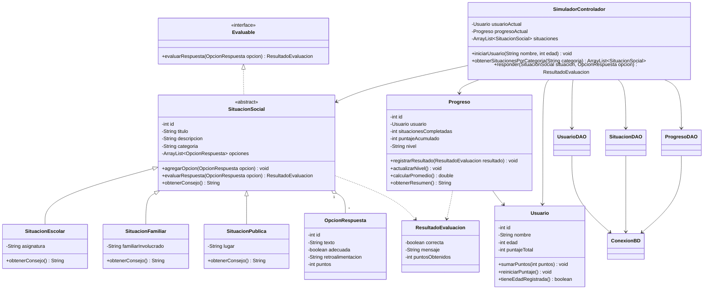

# UML de clases

Este diagrama resume las clases principales del proyecto y sus relaciones.

```mermaid
classDiagram
    class Evaluable {
        <<interface>>
        +evaluarRespuesta(OpcionRespuesta opcion) ResultadoEvaluacion
    }

    class SituacionSocial {
        <<abstract>>
        -int id
        -String titulo
        -String descripcion
        -String categoria
        -ArrayList~OpcionRespuesta~ opciones
        +agregarOpcion(OpcionRespuesta opcion) void
        +evaluarRespuesta(OpcionRespuesta opcion) ResultadoEvaluacion
        +obtenerConsejo() String
    }

    class SituacionEscolar {
        -String asignatura
        +obtenerConsejo() String
    }

    class SituacionFamiliar {
        -String familiarInvolucrado
        +obtenerConsejo() String
    }

    class SituacionPublica {
        -String lugar
        +obtenerConsejo() String
    }

    class OpcionRespuesta {
        -int id
        -String texto
        -boolean adecuada
        -String retroalimentacion
        -int puntos
    }

    class ResultadoEvaluacion {
        -boolean correcta
        -String mensaje
        -int puntosObtenidos
    }

    class Usuario {
        -int id
        -String nombre
        -int edad
        -int puntajeTotal
        +sumarPuntos(int puntos) void
        +reiniciarPuntaje() void
        +tieneEdadRegistrada() boolean
    }

    class Progreso {
        -int id
        -Usuario usuario
        -int situacionesCompletadas
        -int puntajeAcumulado
        -String nivel
        +registrarResultado(ResultadoEvaluacion resultado) void
        +actualizarNivel() void
        +calcularPromedio() double
        +obtenerResumen() String
    }

    class SimuladorControlador {
        -Usuario usuarioActual
        -Progreso progresoActual
        -ArrayList~SituacionSocial~ situaciones
        +iniciarUsuario(String nombre, int edad) void
        +obtenerSituacionesPorCategoria(String categoria) ArrayList~SituacionSocial~
        +responder(SituacionSocial situacion, OpcionRespuesta opcion) ResultadoEvaluacion
    }

    class UsuarioDAO
    class SituacionDAO
    class ProgresoDAO
    class ConexionBD

    Evaluable <|.. SituacionSocial
    SituacionSocial <|-- SituacionEscolar
    SituacionSocial <|-- SituacionFamiliar
    SituacionSocial <|-- SituacionPublica
    SituacionSocial "1" o-- "*" OpcionRespuesta
    SituacionSocial ..> ResultadoEvaluacion
    Progreso --> Usuario
    Progreso ..> ResultadoEvaluacion
    SimuladorControlador --> Usuario
    SimuladorControlador --> Progreso
    SimuladorControlador --> SituacionSocial
    SimuladorControlador --> UsuarioDAO
    SimuladorControlador --> SituacionDAO
    SimuladorControlador --> ProgresoDAO
    UsuarioDAO --> ConexionBD
    SituacionDAO --> ConexionBD
    ProgresoDAO --> ConexionBD
```

